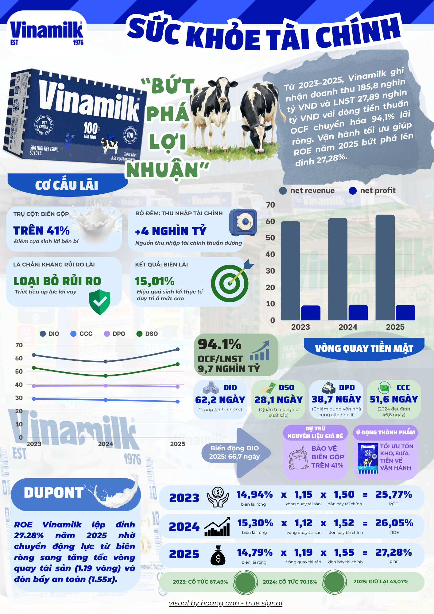
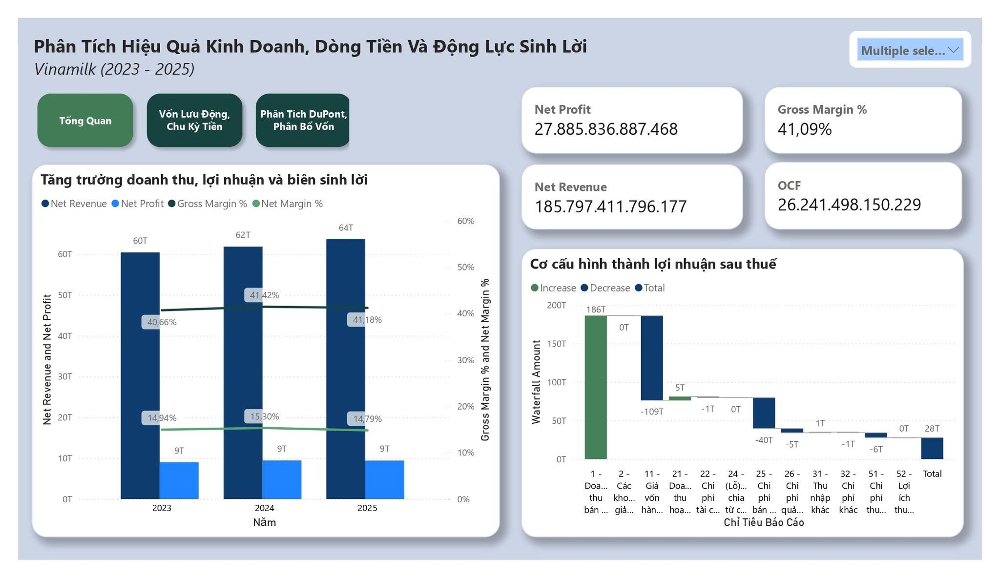
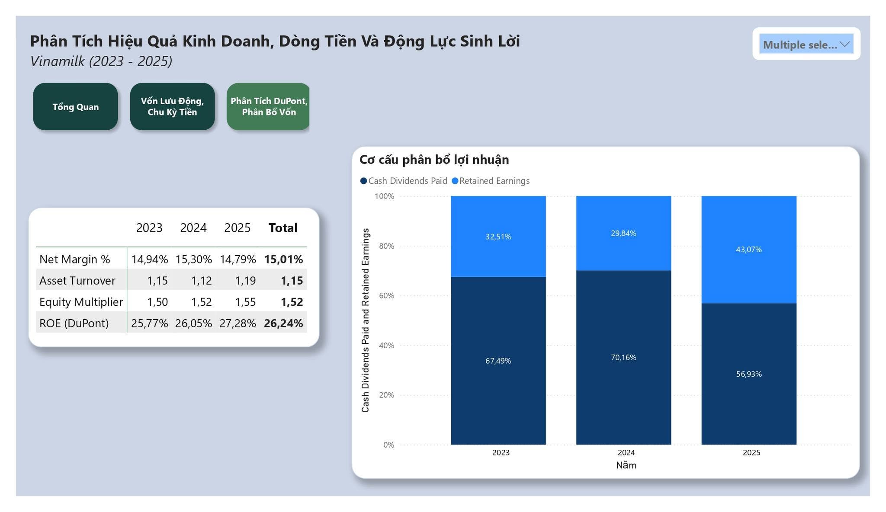

# Phân Tích Mô Tả Báo Cáo Tài Chính Vinamilk (2023 - 2025)

## 1. Giới Thiệu Dự Án
* **Ngôn ngữ**: Tiếng Việt
* **Công cụ:** Power BI Desktop, Microsoft Excel.
* **Kỹ năng chuyên môn:**
  * **Kỹ thuật dữ liệu:** Xử lý & chuyển đổi dữ liệu (Power Query), viết hàm phân tích (DAX), thiết kế mô hình dữ liệu quan hệ (Star Schema), thiết kế giao diện Dashboard tương tác.
  * **Nghiệp vụ tài chính (Domain Knowledge):** Phân tích Báo cáo Tài chính, phân rã tỷ suất sinh lời (DuPont), phân tích chu kỳ tiền mặt (CCC), đánh giá khả năng thanh toán & chất lượng dòng tiền.
* **Mô tả dự án:** Xây dựng hệ thống Dashboard tương tác phân tích toàn diện sức khỏe tài chính Vinamilk giai đoạn 2023–2025. Tự động hóa hơn 20+ chỉ số tài chính đa kỳ và bóc tách động lực tăng trưởng ROE.

---

## 2. Kiến Trúc Dữ Liệu & Đo Lường DAX

Mô hình dữ liệu được thiết kế theo Star Schema với bảng `FinancialVinamilkData` liên kết cùng bảng danh mục chuẩn hóa `DimFinancialItems`.

### Các Công Thức DAX Cốt Lõi

```dax
Net Margin % = DIVIDE([Net Profit], [Net Revenue], 0)
```

```dax
Asset Turnover = 
DIVIDE(
    [Net Revenue],
    CALCULATE(
        SUM(FinancialVinamilkData[Giá Trị]),
        DimFinancialItems[Mã Số] = "270" -- Mã số Tổng cộng tài sản trên BCDKT
    ),
    0
)
```

```dax
Equity Multiplier = 
DIVIDE(
    CALCULATE(
        SUM(FinancialVinamilkData[Giá Trị]),
        DimFinancialItems[Mã Số] = "270" -- Mã số Tổng cộng tài sản
    ),
    CALCULATE(
        SUM(FinancialVinamilkData[Giá Trị]),
        DimFinancialItems[Mã Số] = "400" -- Mã số Vốn chủ sở hữu
    ),
    0
)
```

```dax
ROE (DuPont) = 
ROUND([Net Margin %], 4) * ROUND([Asset Turnover], 2) * ROUND([Equity Multiplier], 2)
```

```dax
DSO = DIVIDE([Accounts Receivable], [Net Revenue], 0) * 365
```

```dax
DIO = DIVIDE([Inventory], [COGS], 0) * 365
```

```dax
DPO = DIVIDE([Accounts Payable], [COGS], 0) * 365
```

```dax
CCC = [DIO] + [DSO] - [DPO]
```
## 3. Tổng Quan: Bán Sữa Thu Tiền Thật Và Bí Mật Đằng Sau Tỷ Lệ Cổ Tức 2025

Nhiều người nghĩ ngành sữa đã bão hòa thì Vinamilk (VNM) khó tạo ra đột phá. Nhưng nhìn vào báo cáo tài chính giai đoạn 2023 - 2025, doanh nghiệp này cho thấy đẳng cấp vượt trội trong việc quản trị vốn và điều tiết dòng tiền:

* **Doanh thu mở rộng đều đặn:** Tổng doanh thu 3 năm đạt 185,8 nghìn tỷ VND (tăng trưởng ổn định 2% - 3%/năm theo đúng đặc trưng của thị trường sữa nội địa bão hòa), mang về 27.886 tỷ VND lợi nhuận sau thuế.
* **Tiền thật về túi, không "lãi ảo":** Dòng tiền thuần từ kinh doanh (OCF) đạt tới 26.240 tỷ VND, đạt tỷ lệ chuyển đổi 94,1% so với lợi nhuận sau thuế. Nghĩa là cứ 100 đồng lãi ghi trên sổ sách thì có hơn 94 đồng là tiền mặt thực tế chảy về két.
* **Tỷ suất sinh lời trên vốn (ROE) lập đỉnh 27,30% năm 2025:** Không cần tăng giá bán để ăn dày biên lãi, công ty vẫn kéo tỷ suất sinh lời lên mức kỷ lục nhờ tăng tốc xoay vòng tài sản.
* **Sự thật về con số cổ tức 2025:** Con số giữ lại 43,07% lợi nhuận trên báo cáo không phải vì công ty "bớt chia tiền", mà bản chất đến từ độ trễ thanh toán các đợt cổ tức kéo dài sang đầu năm 2026 theo nghị quyết ĐHĐCĐ.

---

## 4. Bóc Tách Chi Tiết Từng Lát Cắt Tài Chính
**NỘI LỰC VINAMILK: LÃI DÀY, TIỀN SẠCH VÀ SẴN SÀNG BỨT PHÁ**

* **Trụ cột 1: Biên lãi gộp vững chắc trên 41% (Bình quân đạt 41,09%)**  
  Duy trì ổn định từ 40,66% (2023) lên 41,42% (2024) và 41,18% (2025). Con số này khẳng định sức mạnh đàm phán hợp đồng nguyên liệu đầu vào và vị thế định giá vững vàng của thương hiệu dẫn đầu thị trường.

* **Trụ cột 2: Bộ đệm tài chính "lãi đẻ ra lãi" hơn +4.000 tỷ VND**  
  Nhờ lượng tiền gửi ngân hàng dồi dào, doanh thu tài chính mang về 5.000 tỷ VND trong khi chi phí tài chính chỉ tốn 1.000 tỷ VND. Thặng dư ròng +4.000 tỷ VND (bình quân mỗi năm thu ròng ~1.300 tỷ đồng tiền lãi) giúp Vinamilk xóa bỏ hoàn toàn áp lực lãi vay.

* **Trụ cột 3: Biên lãi ròng bình quân đạt 15,01%**  
  Biên lãi ròng đạt đỉnh 15,30% vào năm 2024 trước khi điều chỉnh nhẹ về 14,79% vào năm 2025 do áp lực chi phí mở rộng thị trường và xúc tiến bán hàng.

* **Trụ cột 4: Chu kỳ tiền mặt 51,6 ngày – Vốn luân chuyển mượt mà**  
  Tốc độ thu hồi nợ từ các đại lý cực nhanh (28,1 ngày), trong khi thời gian trả tiền cho đối tác cung ứng được kéo dài hợp lý (38,7 ngày) mà không gây tổn hại uy tín.

* **ROE cán mốc đỉnh 27,30% năm 2025:** Hiệu quả sinh lời trên mỗi đồng vốn cổ đông đạt mức cao nhất trong 3 năm.
<p align="center">
  <a href="inforgraphic.png">
    
  </a>
  <br>
  <em>Hình 1:  sức khỏe tài chính Vinamilk (Nhấp để phóng to)</em>
</p>

**NỘI LỰC VINAMILK: LÃI DÀY, TIỀN SẠCH VÀ SẴN SÀNG BỨT PHÁ**

* **Trụ cột 1: Biên lãi gộp vững chắc trên 41% (Bình quân đạt 41,09%)**  
  Duy trì ổn định từ 40,66% (2023) lên 41,42% (2024) và 41,18% (2025). Con số này khẳng định sức mạnh đàm phán hợp đồng nguyên liệu đầu vào và vị thế định giá vững vàng của thương hiệu dẫn đầu thị trường.

* **Trụ cột 2: Bộ đệm tài chính "lãi đẻ ra lãi" hơn +4.000 tỷ VND**  
  Nhờ lượng tiền gửi ngân hàng dồi dào, doanh thu tài chính mang về 5.000 tỷ VND trong khi chi phí tài chính chỉ tốn 1.000 tỷ VND. Thặng dư ròng +4.000 tỷ VND (bình quân mỗi năm thu ròng ~1.300 tỷ đồng tiền lãi) giúp Vinamilk xóa bỏ hoàn toàn áp lực lãi vay.

* **Trụ cột 3: Biên lãi ròng bình quân đạt 15,01%**  
  Biên lãi ròng đạt đỉnh 15,30% vào năm 2024 trước khi điều chỉnh nhẹ về 14,79% vào năm 2025 do áp lực chi phí mở rộng thị trường và xúc tiến bán hàng.

* **Trụ cột 4: Chu kỳ tiền mặt 51,6 ngày – Vốn luân chuyển mượt mà**  
  Tốc độ thu hồi nợ từ các đại lý cực nhanh (28,1 ngày), trong khi thời gian trả tiền cho đối tác cung ứng được kéo dài hợp lý (38,7 ngày) mà không gây tổn hại uy tín.

* **ROE cán mốc đỉnh 27,30% năm 2025:** Hiệu quả sinh lời trên mỗi đồng vốn cổ đông đạt mức cao nhất trong 3 năm.

---

### Ảnh 2: 100 Đồng Bán Sữa Được Chia Nhau Như Thế Nào?
*(Ảnh Dashboard 1 – Hiệu quả kinh doanh & Thác nước chi phí)*



**HIỆU QUẢ KINH DOANH: DOANH THU ĐỀU ĐẶN & THÁC NƯỚC BÓC TÁCH CHI PHÍ**

**Doanh thu thuần mở rộng nhịp nhàng theo từng năm:**
* Năm 2023: Đạt 60,0 nghìn tỷ VND.
* Năm 2024: Đạt 62,0 nghìn tỷ VND (tăng +3,3%).
* Năm 2025: Đạt 64,0 nghìn tỷ VND (tăng +3,2%).  
-> Tổng doanh thu thuần 3 năm đạt 185,8 nghìn tỷ VND. Lợi nhuận sau thuế duy trì quy mô cao, đạt tổng cộng 27.886 tỷ VND.

**Bóc tách cấu trúc chi phí qua biểu đồ Thác nước (Waterfall):**
* **Doanh thu bán hàng ~186 nghìn tỷ VND** (các khoản giảm trừ doanh thu gần như bằng 0, chứng minh chất lượng hàng hóa ổn định, đại lý không hoàn trả).
* **Giá vốn hàng bán (COGS) chiếm ~109 nghìn tỷ VND (~58,7% doanh thu):** Đây là khoản chi phí lớn nhất cấu thành nên giá sữa thành phẩm.
* **Chi phí bán hàng chiếm ~40 nghìn tỷ VND (~21,5% doanh thu):** Khoản đầu tư then chốt để bảo vệ thị phần, duy trì hệ thống logistics và hàng trăm nghìn điểm phân phối trên toàn quốc.
* **Chi phí quản lý doanh nghiệp chỉ chiếm ~5 nghìn tỷ VND (~2,7% doanh thu):** Bộ máy vận hành được kiểm soát chặt chẽ và cực kỳ tinh gọn.
* **Doanh thu tài chính (+5 nghìn tỷ) bù đắp chi phí tài chính (-1 nghìn tỷ):** Đóng góp thặng dư ròng +4.000 tỷ VND tiền mặt.
* **Thuế TNDN (-6 nghìn tỷ):** Hoàn thành trọn vẹn nghĩa vụ với ngân sách nhà nước.
* **Kết quả cuối cùng:** Thu về trọn vẹn 27.886 tỷ VND lãi ròng thực tế theo BCTC kiểm toán.

---

### Ảnh 3: Tiền Đi Đâu Và Về Đâu? Bài Toán Quản Trị Kho & Dòng Tiền Sạch
*(Ảnh Dashboard 2 – Vốn lưu động & Chu kỳ tiền mặt)*

![Vốn Lưu Động & Chu Kỳ Tiền Mặt]dashboard 2.jpg)

**QUẢN TRỊ VỐN LƯU ĐỘNG: LÃI ĐẾN ĐÂU, TIỀN TƯƠI VỀ ĐẾN ĐÓ**

**Chất lượng dòng tiền kinh doanh (OCF) vượt trội:**
* Năm 2023: Lãi 9,0 nghìn tỷ -> Tiền mặt kinh doanh thu về 7,9 nghìn tỷ VND.
* Năm 2024: Lãi 9,5 nghìn tỷ -> Tiền mặt vọt lên tới 9,7 nghìn tỷ VND (tiền mặt thu về vượt cả lãi kế toán nhờ giải phóng tồn kho và thu hồi công nợ xuất sắc).
* Năm 2025: Lãi 9,4 nghìn tỷ -> Tiền mặt về 8,7 nghìn tỷ VND.  
-> Tỷ lệ OCF/LNST bình quân đạt 94,1%, rủi ro "lãi trên giấy" bằng 0, tạo nền tảng vững chắc để trả cổ tức tiền mặt đều đặn.

**Bóc tách 4 chỉ số chu kỳ tiền mặt & Thuyết minh tồn kho 2025:**
* **DSO (Kỳ thu tiền khách hàng):** Rút ngắn liên tục từ 29,1 ngày -> 28,3 ngày -> 27,0 ngày (Bình quân 28,1 ngày). Khẳng định vị thế chi phối đại lý và kỷ luật thu hồi nợ nghiêm ngặt.
* **DPO (Kỳ trả nợ nhà cung cấp):** Duy trì quanh 38,8 ngày -> 39,1 ngày -> 38,3 ngày (Bình quân 38,7 ngày). Chiếm dụng vốn nhà cung cấp hợp lý mà không làm tổn hại quan hệ đối tác.
* **DIO (Kỳ lưu kho) & Căn cứ Thuyết minh BCTC:** Từ 62,4 ngày -> giảm xuống 57,4 ngày (2024) -> tăng lên 66,7 ngày (2025) (Bình quân 62,2 ngày), kéo chu kỳ tiền mặt (CCC) năm 2025 lên 55,4 ngày.
* **Bản chất tồn kho tăng năm 2025:** Theo Thuyết minh BCTC, hàng tồn kho tăng lên chủ yếu là Nguyên vật liệu (bột sữa nhập khẩu giá rẻ) được Vinamilk chủ động gom mua ở đáy chu kỳ hàng hóa thế giới nhằm khóa chặt biên lợi nhuận gộp trên 41% cho các năm sau, hoàn toàn không phải do ứ đọng thành phẩm vì sức mua chậm!

---

### Ảnh 4: Công Thức DuPont Đưa ROE Lập Đỉnh & Sự Thật Về Cổ Tức 2025
*(Ảnh Dashboard 3 – Mô hình DuPont & Phân bổ vốn)*



**MÔ HÌNH DUPONT & PHÂN BỔ VỐN: NGHỆ THUẬT TỐI ƯU HÓA NỘI LỰC**

**Bóc tách công thức sinh lời DuPont 3 yếu tố qua từng năm:**  
*Công thức: Hiệu quả dùng vốn (ROE) = Biên lãi ròng x Vòng quay tài sản x Đòn bẩy tài chính*

* Năm 2023: 14,94% x 1,15 vòng x 1,50 = 25,75% (Mức sinh lời nền tảng vững chắc).
* Năm 2024: 15,30% x 1,12 vòng x 1,52 = 26,13% (Biên lãi ròng đạt đỉnh 15,30% bù đắp cho vòng quay tài sản giảm nhẹ).
* Năm 2025: 14,79% x 1,19 vòng x 1,55 = 27,30% (Lập đỉnh 3 năm).
* Trung bình 3 năm: 15,01% x 1,15 vòng x 1,52 = 26,39%.

* **Phát hiện cốt lõi:** Dù doanh thu chỉ tăng 2% - 3%/năm do thị trường bão hòa và biên lãi ròng năm 2025 hạ nhẹ, Vinamilk vẫn đưa ROE lập đỉnh nhờ đẩy mạnh vòng quay tài sản lên 1,19 vòng. Doanh nghiệp đã vắt tối đa công suất của hệ thống nhà xưởng và mạng lưới phân phối để tạo ra nhiều doanh thu hơn trên mỗi đồng tài sản.

**Bản chất về sự thay đổi tỷ lệ cổ tức năm 2025:**
* Năm 2023 - 2024: Chi trả cổ tức tiền mặt chiếm áp đảo với tỷ lệ lần lượt là 67,49% và 70,16%.
* Năm 2025: Tỷ lệ thực chi tiền mặt trên báo cáo là 56,93%, tương ứng lợi nhuận giữ lại tạm tính là 43,07%.
* **Giải mã thực tế:** Việc tỷ lệ chi trả tiền mặt năm 2025 ghi nhận 56,93% chủ yếu do các đợt tạm ứng cổ tức của niên độ 2025 bị kéo dài thời gian thanh toán sang đầu năm 2026 (độ trễ thanh toán theo đợt của ĐHĐCĐ). Bước đi này vừa đảm bảo cổ tức cho cổ đông, vừa giúp doanh nghiệp duy trì một bộ đệm thanh khoản tiền mặt an toàn và linh hoạt trong giai đoạn chuyển giao.

---

## 5. Bài Học Quản Trị Từ Báo Cáo Của Vinamilk

1. **Quản trị dòng tiền là vua:** Lợi nhuận kế toán chỉ có giá trị khi tỷ lệ OCF/LNST đạt mức cao (~94%), tiền về tài khoản đều đặn.
2. **Chiến lược gom hàng tồn kho thông minh:** Tăng tồn kho khi giá nguyên liệu ở đáy chu kỳ là cách phòng thủ biên lãi gộp hiệu quả nhất cho tương lai.
3. **Khai thác tối đa hiệu suất tài sản:** Khi thị trường ngành bão hòa, tăng tốc vòng quay tài sản (Asset Turnover) chính là chìa khóa duy nhất để kéo tỷ suất sinh lời ROE lên đỉnh cao mới.
4. **Điều tiết cổ tức linh hoạt:** Tận dụng độ trễ thanh toán cổ tức để giữ lại dòng tiền đệm an toàn trước khi giải ngân cho các dự án lớn như Siêu nhà máy Hưng Yên hay mở rộng đàn bò công nghệ cao.

---

## 6. Tác Giả & Liên Hệ

* **Họ và tên:** Huỳnh Hoàng Anh 
* **Định hướng chuyên môn:** Data Analyst / Financial Data Analyst / Risk Analyst
* **Email:** hoanganhhuynhh92@gmail.com
